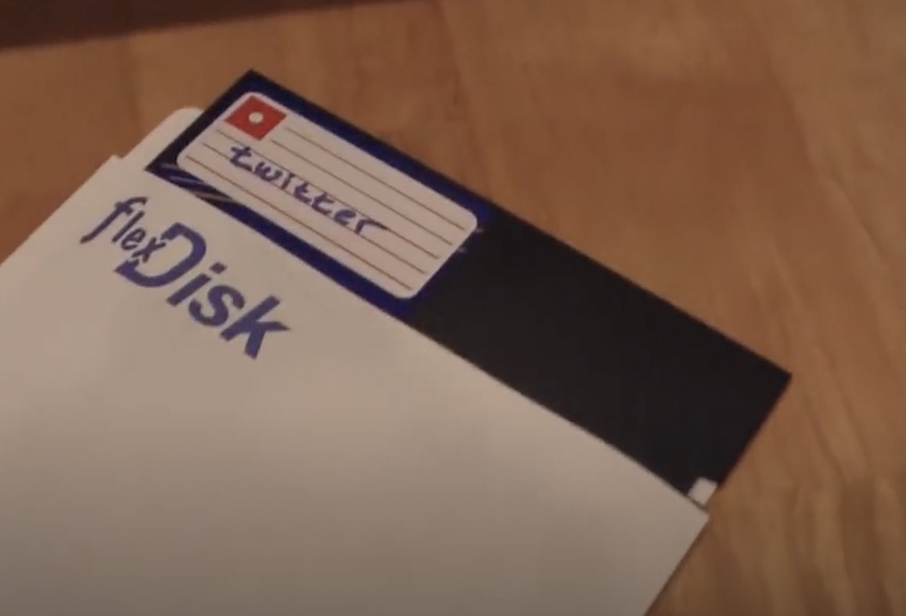

# Apple IIt

Twitter display using an Apple II computer. Shown at Maker Faire Bay Area

Details on the build are at http://atomsandelectrons.com/blog/2010/04/apple-t/

Documentation is getting fleshed out. For the ambitious among you, take a look at
Documentation.pdf which explains what you'll need to purchase to construct the
PC->Apple II communication cable.

At this point there should be enough info and working code for a motivated individual
to get their own Apple II Twitter Display up and running. It's mostly cleanup and
better documentation that's lacking now.

# Examples

# Demo Video

See it running on [YouTube](https://www.youtube.com/watch?v=j622EyPX6lM "JEP")
